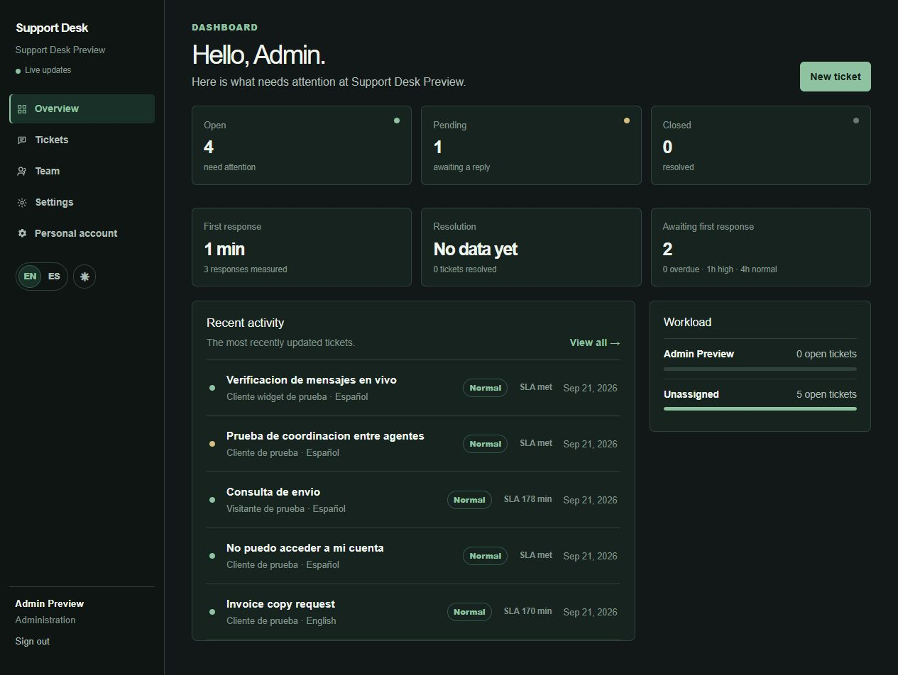

# Bilingual Support Desk



A local support desk for handling English and Spanish requests by organization. It includes a team dashboard, secure sessions, and a public widget for starting and following conversations.

## Run locally

Requires Node.js 24 or later and Python 3.11 or later.

```powershell
npm.cmd ci
$env:DATABASE_PATH = "$PWD\data\support.sqlite"
$env:APP_ORIGIN = "http://localhost:3010"
npm.cmd run dev -- --port 3010
```

Start the local analysis service in another terminal:

```powershell
python python-service\analyzer.py
```

Alternatively, `npm.cmd run dev:all -- --port 3010` starts the analysis service when it is not already healthy on port 8001, then starts Next.js; it stops only the analysis child it started. `dev` remains available when only Next.js is needed. Open `http://localhost:3010` and register the first organization. Its first user administers users and settings.

## Local demo data

With the server stopped, use a local database and run:

```powershell
$env:DEMO_MODE = "true"
npm.cmd run seed
```

The seed creates two organizations with synthetic data. It generates a temporary key and shows it once. Existing users retain their credentials.

## Demo access

The demo account uses synthetic data in a separate organization. It does not modify other organizations or users. If its email or reserved identifiers exist in unrelated data, it fails without changing anything.

```powershell
$env:DEMO_MODE = "true"
npm.cmd run seed:recruiter
```

Demo account credentials:

```text
recruiter@example.test
SupportDeskDemo2026!
```

Run this only for a local demo instance. It does not change the password of an existing demo account.

With `DEMO_MODE=true`, `recruiter-admin` in `recruiter-demo` can reset that organization’s synthetic tickets, messages, and events from [/demo](/demo). Resetting requires an administrator session and same-origin request, is locally rate-limited, and preserves the organization, team, and credentials. It never resets other organizations. Do not use it against a database with real data.

## Public widget

Set the organization’s allowed origin and load the script with its key:

```html
<script src="https://your-domain.example/widget.js" data-key="YOUR_WIDGET_KEY"></script>
```

The widget keeps its conversation token in `sessionStorage`. Requests do not use cookies. The token can read and reply only to its own conversation. It defaults to English and follows `data-lang`/`data-theme` on the script or host document. Hosts can also dispatch `support-widget-preferences` with `{ locale, theme }`; switching either leaves the active conversation and form drafts intact.

## Capabilities

- Opaque `httpOnly` cookie sessions and `scrypt`-protected passwords
- Organization data separation and administrator permissions
- Tickets, messages, states, priorities, and assignment
- `409` version conflicts that prevent stale edits from overwriting newer work
- First-response SLA by elapsed hours and priority, retained after the first reply
- First-response, pending, and resolution metrics; reopening and closing again counts as a new resolution
- Live SSE updates with 1.5-second polling in a single instance
- Rate-limited synthetic demo reset, plus lint, Node, Python, and isolated integration checks
- Origin-specific CORS and local request limits for the widget
- Persistent English/Spanish interface and light/dark themes; widget settings follow the host without clearing drafts
- Self-service profile updates require the current password for email or password changes and revoke other sessions
- A local Python service with deterministic text classification and extractive summaries

## Limits

SQLite, SSE, and request limiting are designed for one local instance. SLA measures elapsed hours, not business calendars. A multi-instance or high-concurrency deployment needs a managed database, migrations, backups, observability, and a security review. Authentication does not include password recovery or MFA. The Python service listens only on `127.0.0.1:8001` and is not intended for public exposure.

The synthetic recruiter demo administrator profile is intentionally locked.

## Verification

```powershell
npm.cmd run lint
npm.cmd run test:node
python -m unittest python-service.test_analyzer -v
npm.cmd run build
npm.cmd run test:integration
```

The integration check creates a temporary SQLite database, selects a free loopback port, starts and stops the production server, and removes its resources afterwards. It covers session limits, organization isolation, and demo reset when enabled and disabled. It does not use local accounts or databases and does not certify an internet deployment.
